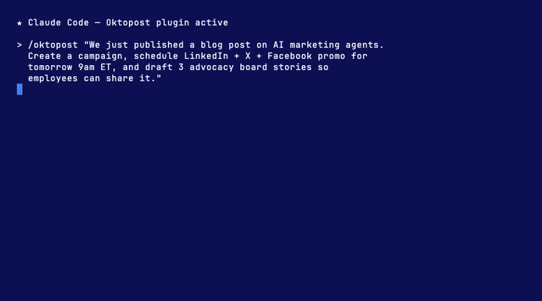
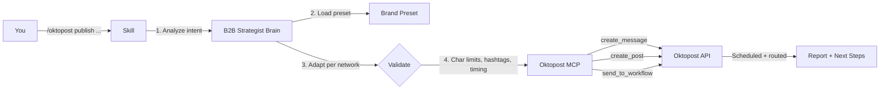

<pre>
   ___   _    _                             _
  / _ \ | | _| |_   ___   _ __    ___   ___| |_
 | | | || |/ / __| / _ \ | '_ \  / _ \ / __| __|
 | |_| ||   <| |_ | (_) || |_) || (_) |\__ \ |_
  \___/ |_|\_\\__| \___/ | .__/  \___/ |___/\__|
                         |_|

              B2B to the core  ×  Claude Code

                      .-~~~~~~-.
                     /  o      o \
                    |              |
                    |   <~~~~~~>   |     <-- the 'stache
                     \            /
                      '.________.'
                     / /  | |  \ \
                    / /   | |   \ \
                   ( |    | |    | )
                    \ \   | |   / /
                     '-'._| |_.'-'
</pre>

# oktopost-claude

**Your AI-powered B2B social media command center, powered by Oktopost + Claude.**

Turn Claude into a B2B social media strategist that orchestrates Oktopost's ~40 MCP tools with domain expertise, guardrails, and analytics interpretation.

- **Strategist**: Claude doesn't just execute, it advises on B2B social best practices
- **Orchestrator**: multi-step workflows (campaign, messages, posts, approval, advocacy) in a single command
- **Analyst**: interprets performance data with B2B benchmarks, not just raw numbers





---

## Quick start

```bash
# Install
curl -fsSL https://raw.githubusercontent.com/Oktopost/oktopost-claude/main/install.sh | sh

# Connect your Oktopost account
/oktopost setup

# Publish your first post
/oktopost publish "Employee advocacy drives 8x more engagement than brand channels. Here's why B2B marketers should care."
```

---

## Installation

### Manual

```bash
git clone https://github.com/Oktopost/oktopost-claude.git
cd oktopost-claude
sh install.sh
```

A one-liner curl is also supported:

```bash
curl -fsSL https://raw.githubusercontent.com/Oktopost/oktopost-claude/main/install.sh | sh
```

---

## Setup

Run `/oktopost setup` inside Claude Code. The skill handles everything conversationally. No terminal, no shell commands, no pasting.

Claude asks you for:
1. Your API key (find it at https://app.oktopost.com/my-profile/api)
2. Your numeric account ID (same page)
3. Your region (US or EU)

Claude validates the credentials against the Oktopost API, then registers the MCP server for you. Claude Code usually hot-loads the new MCP tools within a few seconds. If they don't appear, restart once and run `/oktopost` again.

### For advanced users / CI

**Non-interactive install with MCP registration:**

```bash
sh install.sh --with-mcp YOUR_API_KEY ACCOUNT_ID [us|eu]
```

**Register the MCP server yourself (skip install.sh):**

```bash
claude mcp add oktopost \
  -e OKTOPOST_ACCOUNT_ID=<account-id> \
  -e OKTOPOST_API_KEY=<api-key> \
  [-e OKTOPOST_ACCOUNT_REGION=eu] \
  -- npx oktopost-mcp
```

**Key rotation without the conversation:**

```
/oktopost setup --key NEW_API_KEY --account ACCOUNT_ID --region us
```

**Uninstall:**

```bash
sh install.sh --uninstall
```

Removes the skill from `~/.claude/skills/oktopost/`, the registered MCP server, and the example preset. Your own presets in `~/.oktopost/presets/` are preserved.

Most customers should just use `/oktopost setup` for configuration.

---

## Commands

| Command | What it does |
|---|---|
| `/oktopost help` | List all subcommands with examples |
| `/oktopost publish <content>` | Draft, adapt per network, validate, schedule, and route for approval |
| `/oktopost campaign <brief>` | Full campaign: create campaign, messages, posts, advocacy (UTMs auto-appended by Oktopost) |
| `/oktopost analytics [timeframe]` | Performance reporting with B2B interpretation and benchmarks |
| `/oktopost advocacy <brief>` | Employee advocacy: boards, stories, advocates, engagement tracking |
| `/oktopost inbox` | Social inbox: conversations, replies, tagging, CRM case creation |
| `/oktopost calendar [week\|month]` | Content calendar with gap analysis and suggestions |
| `/oktopost approve` | Review and process pending approval workflow items |
| `/oktopost dashboard [name]` | Browse Social BI dashboards and pull report data |
| `/oktopost preset [list\|create\|use]` | Brand preset management |
| `/oktopost setup` | Configure Oktopost connection |

---

## Examples

### Publish a thought leadership post

```
/oktopost publish "The best employee advocacy programs don't start with tools. They start with culture. Here's a framework we've seen work at 200+ B2B companies."
```

Claude adapts the content for LinkedIn (full post) and X (condensed with thread option), schedules for Tuesday 9am ET, and routes through approval.

### Launch a campaign

```
/oktopost campaign "Q2 webinar promotion: 'The State of B2B Social in 2026'. Webinar date: May 15. Registration link: https://oktopost.com/webinar"
```

Claude creates the campaign, generates pre-event posts (2 weeks, 1 week, 3 days, day-of), sets up an advocacy board, and configures approval routing. Oktopost auto-appends UTMs to okt.to links at publish time.

### Analyze performance

```
/oktopost analytics last 30 days
```

Claude pulls data across campaigns, interprets engagement trends with B2B benchmarks, compares advocacy vs organic reach, identifies top-performing content, and recommends next actions.

### Manage advocacy

```
/oktopost advocacy "Share our new case study about how Acme Corp increased pipeline 40% with social selling"
```

Claude creates a board story with employee-friendly copy (first person, not corporate), suggests hashtags, and assigns it to the relevant topic.

### Morning workflow

```
/oktopost approve
```

Claude shows all pending items with previews, lets you approve or reject with notes, and flags any items pending longer than 24 hours.

---

## Brand presets

The skill ships with `oktopost-example.json` as a **reference template**. It is NOT auto-installed into your active presets directory. If it were, its `REPLACE_WITH_PROFILE_ID` placeholders would block publishing until you edited them.

**Easiest path:** run `/oktopost setup`. It bootstraps a real preset from your connected profiles automatically.

**Manual path:**

1. Copy the reference into your personal presets dir:
   ```bash
   cp ~/.claude/skills/oktopost/presets/oktopost-example.json ~/.oktopost/presets/your-brand.json
   ```
2. Edit `your-brand.json`: replace `REPLACE_WITH_PROFILE_ID` values with the profile IDs from `/oktopost preset show` or `list_social_profiles`.

**What presets define:**

- Voice and tone guidelines
- Hashtag rules
- Content pillars
- Target audience
- Network priorities
- Approval settings
- Optional account credentials for multi-account setups

UTMs are NOT preset-managed. Oktopost auto-appends them to every okt.to link at publish time based on the account's tracking config.

**Preset hierarchy:**

- **Team presets** go in `.claude/skills/oktopost/presets/` (committed to your repo, shared with the team)
- **Personal presets** go in `~/.oktopost/presets/` (local to you, overrides team presets)
- User instructions given in the prompt always override preset values

Switch between presets with `/oktopost preset use <name>`.

---

## Architecture

```
oktopost-claude/
├── skills/oktopost/
│   ├── SKILL.md                    # Core skill (the B2B strategist brain)
│   ├── references/                 # On-demand reference docs
│   │   ├── mcp-tools.md           # All MCP tool parameters + negative docs
│   │   ├── social-networks.md     # Per-network specs and B2B best practices
│   │   ├── workflows.md           # Campaign lifecycle and workflow templates
│   │   ├── analytics.md           # Metrics glossary and B2B benchmarks
│   │   └── api-fallback.md        # Direct REST API reference (fallback)
│   ├── scripts/                   # Python utilities (stdlib only)
│   │   ├── setup.py               # MCP configuration wizard
│   │   ├── validate.py            # Connection verification
│   │   ├── publish.py             # Direct API fallback for publishing
│   │   └── report.py              # Direct API fallback for analytics
│   └── presets/
│       └── oktopost-example.json  # Reference brand preset template
├── agents/
│   ├── content-strategist.md      # Subagent for content ideation
│   └── analytics-interpreter.md   # Subagent for metrics analysis
├── install.sh                     # Standalone installer
└── .claude-plugin/plugin.json     # Marketplace manifest
```

The skill wraps the [`oktopost-mcp`](https://github.com/Oktopost/Oktopost-MCP) npm package, Oktopost's first-party MCP server. The MCP provides ~40 raw tools; the skill adds B2B expertise, multi-step orchestration, guardrails, and analytics interpretation on top.

---

## Requirements

- [Claude Code CLI](https://docs.anthropic.com/en/docs/claude-code)
- An Oktopost account (any plan)
- Node.js 20+ (to run the oktopost-mcp server via npx)
- Python 3.8+ (for fallback scripts; optional)

---

## FAQ

**What networks are supported?**
LinkedIn, X/Twitter, Facebook, and Instagram. The same networks Oktopost supports.

**Do I need the MCP server?**
Recommended for full functionality. Without it, the skill falls back to direct API calls via Python scripts.

**Can I manage multiple accounts?**
Yes. Create a preset per account with `account_id` and `region`, then switch with `/oktopost preset use <name>`.

**What about rate limits?**
20,000 API calls per day, 60 per minute. The skill handles backoff automatically.

**Is my data safe?**
The skill runs locally in your Claude Code session. No data is sent to third parties beyond Oktopost's own API.

---

## Contributing

Pull requests are welcome. See [CONTRIBUTING.md](CONTRIBUTING.md) for guidelines. For local development, run:

```bash
sh install.sh
```

---

## License

[Apache-2.0](LICENSE)

---

## Links

- [Oktopost](https://www.oktopost.com)
- [Oktopost MCP Server](https://github.com/Oktopost/Oktopost-MCP)
- [Oktopost API Docs](https://developers.oktopost.com/docs)
- [Claude Code](https://docs.anthropic.com/en/docs/claude-code)
